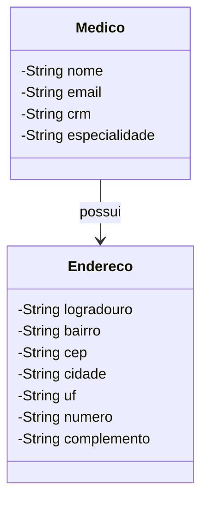

# 🏥 Clínica Médica - Sistema de Gestão de Médicos

Este projeto é um sistema simples de gestão de médicos para uma clínica, que utiliza **Java** com **Spring Boot** e **H2** como banco de dados em memória. Ele permite o cadastro e gerenciamento de médicos, armazenando suas informações como nome, email, CRM, especialidade e endereço. O sistema foi desenvolvido com uma interface web usando **Thymeleaf**, e utiliza **Lombok** para reduzir o código boilerplate.

## 🎯 Funcionalidades

- Cadastro de médicos com nome, CRM, especialidade e endereço completo.
- Listagem de médicos cadastrados.
- Atualização e remoção de médicos.
- Persistência de dados em banco de dados em memória (H2).

## 📋 Diagrama de Classes

O modelo de dados do projeto segue a estrutura abaixo, com uma relação entre as classes `Medico` e `Endereco`:



## 🚀 Tecnologias Utilizadas

As principais tecnologias usadas no desenvolvimento deste projeto incluem:

- **Java 17**: Linguagem principal do projeto.
- **Spring Boot**: Framework para criação do backend com suporte a REST APIs e injeção de dependências.
- **H2 Database**: Banco de dados em memória utilizado para armazenar as informações dos médicos.
- **SQL**: Linguagem para manipulação dos dados no banco de dados H2.
- **Lombok**: Biblioteca que ajuda a reduzir o código repetitivo, como getters, setters e construtores.
- **Thymeleaf**: Template engine utilizada para renderização da interface web.

## 📦 Instalação e Configuração

### 1. Pré-requisitos

Certifique-se de ter instalado em seu ambiente de desenvolvimento:

- **Java 17** ou versão superior.
- **Maven** para gerenciamento de dependências.
- **Git** para controle de versão.

### 2. Clonando o Repositório

Clone o projeto em sua máquina local utilizando o comando:

```bash
git clone https://github.com/seu-usuario/clinica-medica.git
```

### 3. Rodando o Projeto

Navegue até o diretório do projeto e execute os seguintes comandos para rodar a aplicação:

```bash
cd clinica-medica
mvn spring-boot:run
```

O sistema estará disponível em `http://localhost:8080`.

## 💻 Interface Web

A interface web do sistema permite o cadastro e gerenciamento de médicos. A aplicação usa **Thymeleaf** para renderizar o frontend, que se conecta ao backend via **Spring MVC**.

## 🗃️ Banco de Dados H2

Este projeto utiliza o banco de dados H2, que é embutido e executado em memória. Para acessar o console web do H2, basta acessar a URL:

```
http://localhost:8080/h2-console
```

As configurações de conexão estão no arquivo `application.properties`:

```properties
spring.h2.console.enabled=true
spring.datasource.url=jdbc:h2:mem:clinicadb
spring.datasource.driverClassName=org.h2.Driver
spring.datasource.username=sa
spring.datasource.password=password
```

## 🤝 Contribuições

Contribuições são sempre bem-vindas! Sinta-se à vontade para abrir *issues* e *pull requests*.

## 📄 Licença

Este projeto está licenciado sob a [MIT License](LICENSE).
